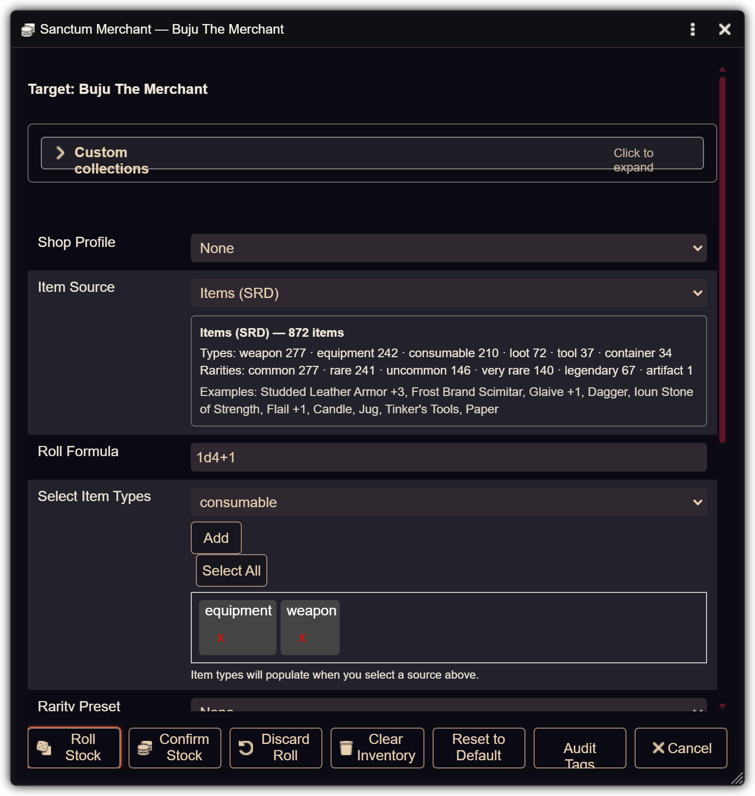
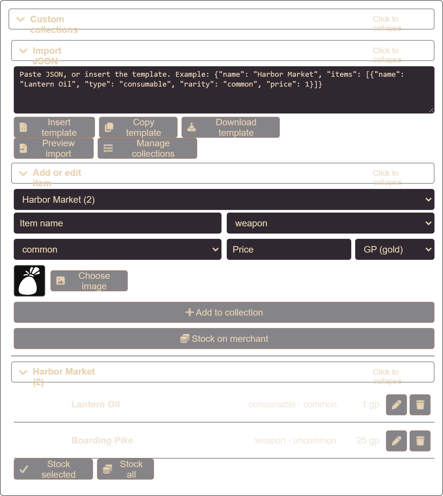
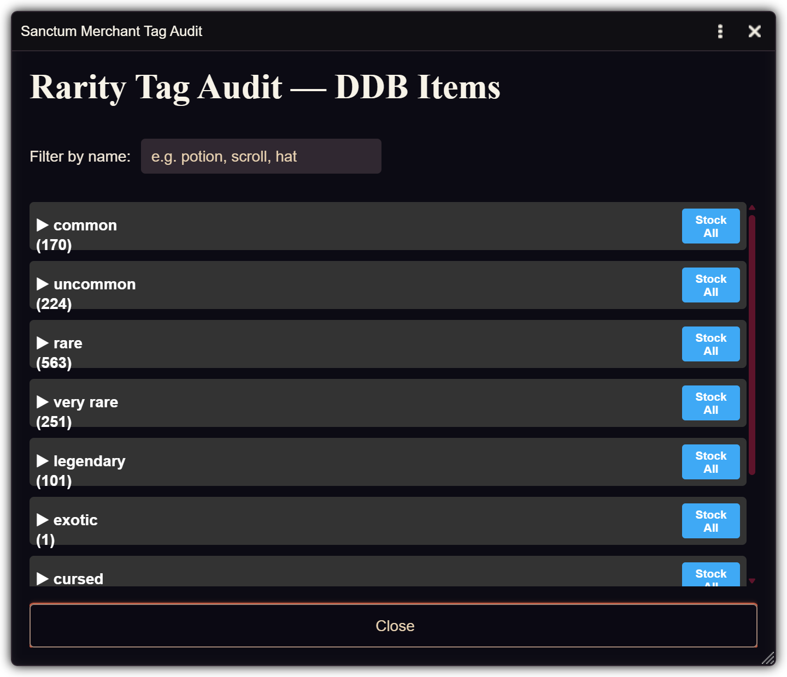
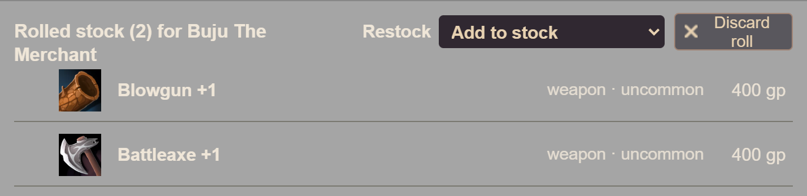
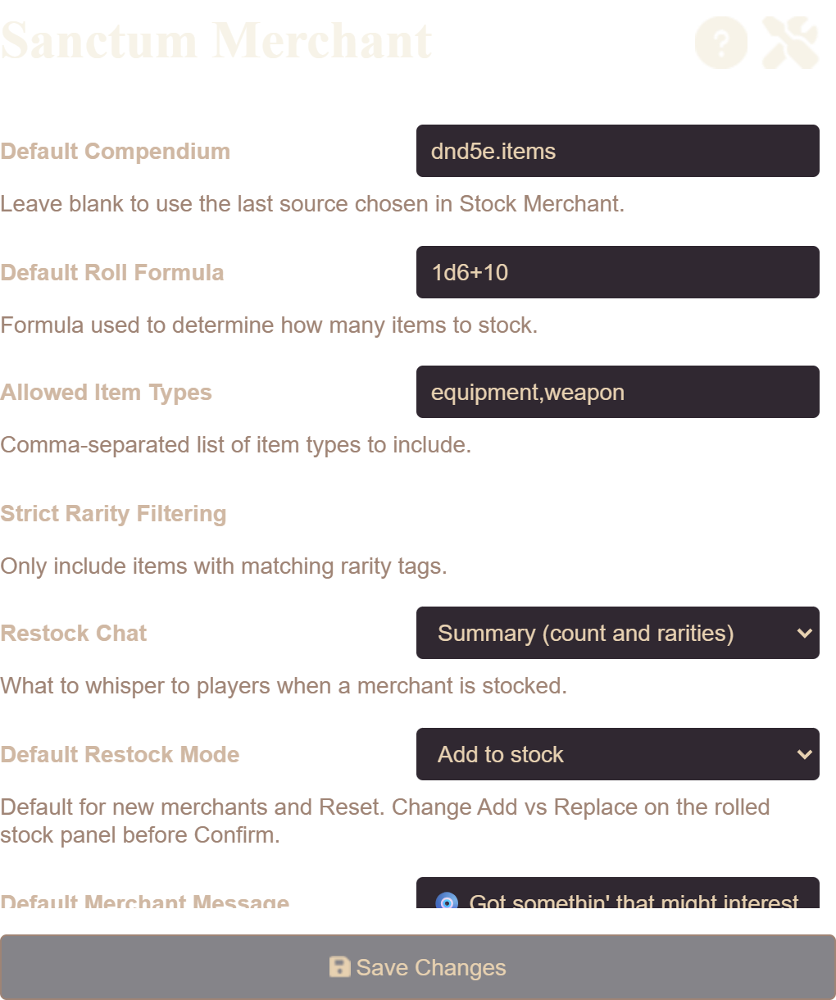

# Sanctum Merchant

Like my work? Buy me a coffee!
<br/>
[](https://ko-fi.com/W7W31LXJ6F)

[](https://foundryvtt.com/)
)
)
[](LICENSE)

A merchant stocking system with Item Piles integration for Foundry VTT. Automate shop inventories with rarity filtering, roll-based quantities, and items from compendiums or pasted JSON.

**Current release: 1.3.0** — verified on Foundry Virtual Tabletop **Version 14 Stable (Build 367)**. See the [changelog](CHANGELOG.md).

### What's new

- **1.3.0** — persisted custom collections, shop profiles, JSON template and preview, Add vs Replace on the rolled list, prices, and double-click item sheets.
- **1.2.0** — per-merchant saved shops, add vs replace restock, roll-then-confirm preview, and restock chat Off / Summary / Full.
- **1.1.1** — optional silent restocks.
- **1.1.0** — Foundry **V14** support (Application V2 dialogs, Actors-tab button, Item Piles header button).


*Stock Merchant dialog (1.2.0): per-shop target, filters, add vs replace, restock chat, and Roll / Confirm Stock*

## Features

### Stock Merchant button on the Actors tab

- **Stock NPC and player characters**: the **Stock Merchant** button appears in the Actors directory header on the right-hand sidebar.

  

### Item Piles integration

- **Header button**: **Stock Merchant** appears on Item Piles merchant windows next to Open Sheet / Show To Players.
- **Automatic detection**: uses the Item Piles API to recognize merchant piles and controlled tokens.
- **Native add/remove**: stocks and clears inventory through `game.itempiles.API.addItems` / `removeItems`.


*Stock Merchant in the Item Piles merchant header, next to Open Sheet / Show To Players*

### Flexible item sourcing

- **Compendiums**: Item Source lists every Foundry **Item** pack (world, system, and modules), grouped by where it lives. Your Oathbreaker DDB gear is **DDB Items** under the World group.
- **Custom collections**: import JSON or add items by hand. Collections are saved in the world and survive reload.
- **JSON template**: insert, copy, or download a starter collection, preview the items, then save as a new collection or merge into an existing one.
- **Add item**: name, type, rarity, optional price, and **Choose image** (Foundry file picker — browse the world or upload).
- **Stock on merchant**: save that item to the collection and put it on the current shop without rolling.
- **Stock selected / Stock all**: check items already in a collection and add them to the merchant with no roll.
- **Edit / Delete**: change or remove items already in a collection.
- **Dynamic types**: item types are read from the selected source.
- **Last source remembered**: merchant flags first, then the last source used in Stock Merchant, then the first Item pack.


*Custom collections: import JSON, manage saved catalogs, or add a single item*

JSON collections use this shape. `name` is required on each item. `type` defaults to equipment, `rarity` to common. `price` is an amount; `priceDenomination` is `cp`, `sp`, `ep`, `gp`, or `pp` (gold if omitted).

```json
{
  "name": "Harbor Market",
  "items": [
    {
      "name": "Lantern Oil",
      "type": "consumable",
      "rarity": "common",
      "price": 1,
      "priceDenomination": "gp"
    }
  ]
}
```

A bare array of items, a single item object, or a Foundry `{ "results": [...] }` dump also import. Preview first, then save as a new collection or merge into one you already have. Export downloads the same template shape (no `_id`).

Coin values: 100 cp = 1 gp, 10 sp = 1 gp, 2 ep = 1 gp, 1 pp = 10 gp.

### Filtering

- **Item types**: weapons, equipment, consumables, loot, containers, tools, and any types the source provides.
- **Rarity tags**: common through legendary, plus campaign tags (exotic, cursed, forged, sanctum-blessed).
- **Strict vs loose**: exact rarity match, or all items with matching rarities weighted higher.
- **Roll formula**: dice notation such as `1d6+2` for how many items to stock.
- **Restock chat**: Off (silent), Summary (count and rarities), or Full list of item names.

Those controls live in the Stock Merchant dialog above: item type tags, rarity tags or a preset, strict filtering, restock mode, and restock chat. After you roll, **Add vs Replace** is also on the rolled stock panel so you can choose it at confirm time. The world setting is only the default. Rows show price. Double-click a rolled item or a custom collection item to open its full sheet.

### Shop profiles

- **General store**: equipment, loot, consumable · common / uncommon · `1d6+2`
- **Alchemist**: consumable, loot · common / uncommon / rare · `1d4+2`
- **Blacksmith**: weapon, equipment · common / uncommon / rare · `1d6` · replace
- **Fence**: loot, equipment, weapon · rare / very rare / cursed / exotic · `1d4+1` · replace, chat off

Applying a profile fills the form. Confirm Stock still saves those filters on that merchant.

### Rarity presets

- **Starter Gear**: common and uncommon
- **Legendary Vault**: legendary, very rare, sanctum-blessed
- **Exotic Bazaar**: rare, exotic, sanctum-blessed
- **Cursed Curiosities**: cursed, forged, rare
- **Chaos Stock**: mixed rarities

### Audit tools

- Group a source’s items by detected rarity
- Stock one item or an entire rarity group
- Filter the audit list by name


*Tag audit: items grouped by rarity, filter by name, stock one group or the whole list*

## Installation

### Manifest URL

1. In Foundry, open **Add-on Modules**.
2. Click **Install Module**.
3. Search for **Sanctum Merchant**, or paste this Manifest URL:

```
https://github.com/Snelly87/Sanctum-Merchant/releases/latest/download/module.json
```

4. Click **Install**, then enable the module in your world.

If you already had 1.0.0 installed and it disappeared after moving to Foundry 14, install 1.3.0 from that URL and enable **Sanctum Merchant** again in Manage Modules.

### Manual install

Clone or copy the `sanctum-merchant` folder into Foundry’s `Data/modules` directory, then enable it in the world.

### Requirements

- **Foundry VTT**: 13 or higher (verified on 14.367)
- **Module**: [Item Piles](https://foundryvtt.com/packages/item-piles) — needed for merchant windows and the header Stock button
- **Game systems**: system-agnostic; works with any system Item Piles supports (including D&D 5e)

## Usage

1. Select an Item Piles merchant token, or open its merchant window.
2. Click **Stock Merchant** on the Actors tab or in the Item Piles window header.
3. Choose a source, item types, rarity tags or a preset, restock mode (add or replace), chat mode, and a roll formula.
4. Click **Roll Stock**. Uncheck any items you do not want, then **Confirm Stock**.
5. Filters are saved on that merchant. Use **Clear Inventory** to empty it, or **Audit Tags** to stock specific items.


*Roll Stock preview: uncheck rows to skip them before Confirm Stock*

### Filtering

- **Item Types**: categories to include
- **Rarity Tags / Presets**: which rarities to pull
- **Strict Mode**: on = only those rarities; off = all items, with matching rarities favored
- **Roll Formula**: how many items to add (for example `1d6+2`)

Items already on the merchant (same name) are not added again when using the direct fallback path.

### JSON import format

```json
{
  "name": "Custom Collection Name",
  "items": [
    {
      "_id": "unique-item-id",
      "name": "Magic Sword",
      "type": "weapon",
      "system": {
        "rarity": "rare",
        "description": {
          "value": "<p>A gleaming magical blade...</p>"
        }
      },
      "img": "icons/weapons/swords/sword-magic-glowing.webp"
    }
  ]
}
```

JSON collections are stored in the world and stay until you delete them.

### Settings


*Module settings: default source, formula, types, restock chat, and add vs replace*

**Configure Settings → Module Settings → Sanctum Merchant**

- **Default Compendium**
- **Default Roll Formula**
- **Allowed Item Types**
- **Strict Rarity Filtering**
- **Default Restock Mode**: add to stock, or replace (clear then add)
- **Restock Chat**: Off, Summary, or Full list of item names
- **Merchant Message** (used for Summary and Full chat modes)

## API

```javascript
game.sanctumMerchant

await game.sanctumMerchant.populateMerchantWithJSON({
  source: "compendium-id-or-json-collection-id",
  sourceType: "compendium", // or "json"
  rollFormula: "1d6+2",
  allowedTypes: ["weapon", "equipment"],
  rareTags: ["common", "uncommon"],
  strictRarity: true,
  merchantMessage: "New stock has arrived!",
  restockChatMode: "summary", // "off" | "summary" | "full"
  restockMode: "replace" // "add" | "replace"
});

const result = await game.sanctumMerchant.JSONImportManager.importJSON(jsonData);
// or preview first:
const parsed = game.sanctumMerchant.JSONImportManager.parseJSON(jsonData);
await game.sanctumMerchant.JSONImportManager.saveParsed(parsed, { name: "Harbor Market" });
// merge: saveParsed(parsed, { collectionId })

await game.sanctumMerchant.auditTags();
```

Export samples from the current source (downloads a JSON file):

```javascript
const data = await game.sanctumMerchant.exportItemsByRarity({ samplesPerRarity: 2 });
console.log(JSON.stringify(data, null, 2));

game.sanctumMerchant.quickExport();
game.sanctumMerchant.fullExport();
```

## Debugging

In the browser console (F12):

```javascript
game.sanctumMerchant.toggleDebug();
```

That turns verbose Sanctum Merchant logging on or off. On load you should see:

```
Sanctum Merchant | Script loaded
Sanctum Merchant | Ready. Toggle debug with game.sanctumMerchant.toggleDebug()
```

## Compatibility

### Foundry versions

| | |
|---|---|
| **Minimum** | 13 |
| **Verified** | 14.367 |
| **Not supported** | 11 and 12 |

### Game systems

System-agnostic. Tested with D&D 5e.

### Known issues

- Very large custom collections live in world settings; keep catalogs to what you actually sell.
- Very large packs (1000+ items) can take a moment to filter.
- Unlinked merchant tokens stock the **token actor** (what Item Piles sells). The world actor sheet can look empty even when the merchant window is full.

## Changelog

- **[1.3.0](CHANGELOG.md)** — persisted collections, shop profiles, JSON template/preview, prices, item sheets
- **[1.2.0](CHANGELOG.md)** — per-merchant shops, preview, add/replace, chat modes
- **[1.1.1](CHANGELOG.md)** — silent restock option
- **[1.1.0](CHANGELOG.md)** — Foundry V14 compatibility

Full notes: [CHANGELOG.md](CHANGELOG.md).

## License

MIT — see [LICENSE](LICENSE).

## Credits

- Built for [Foundry Virtual Tabletop](https://foundryvtt.com/)
- Integrates with [Item Piles](https://foundryvtt.com/packages/item-piles) by Fantasy Computerworks
- Icons from [Font Awesome](https://fontawesome.com/)

## Support

- **Issues**: [GitHub Issues](https://github.com/Snelly87/Sanctum-Merchant/issues)
- **Discussions**: [GitHub Discussions](https://github.com/Snelly87/Sanctum-Merchant/discussions)
- **Discord**: [Foundry VTT Discord](https://discord.gg/foundryvtt) — #modules-troubleshooting
